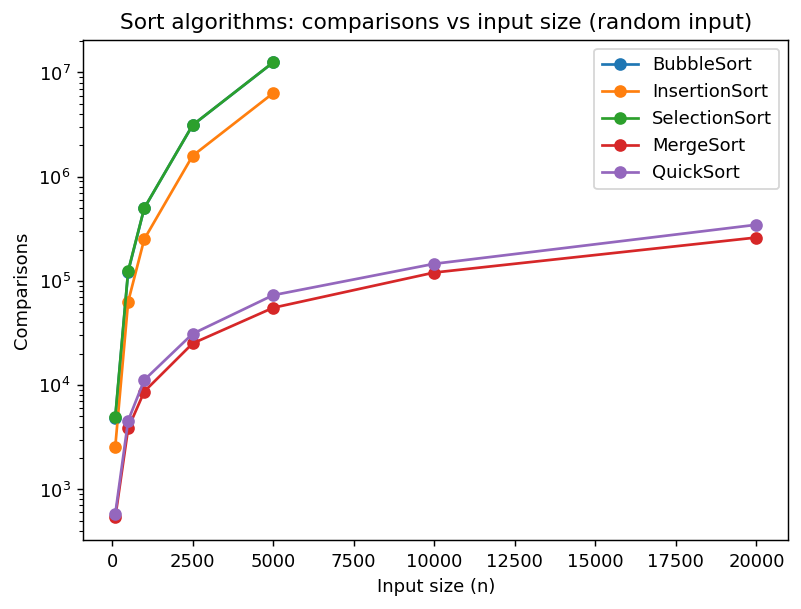
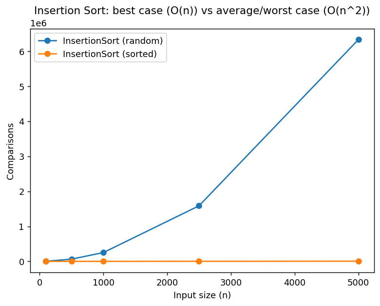
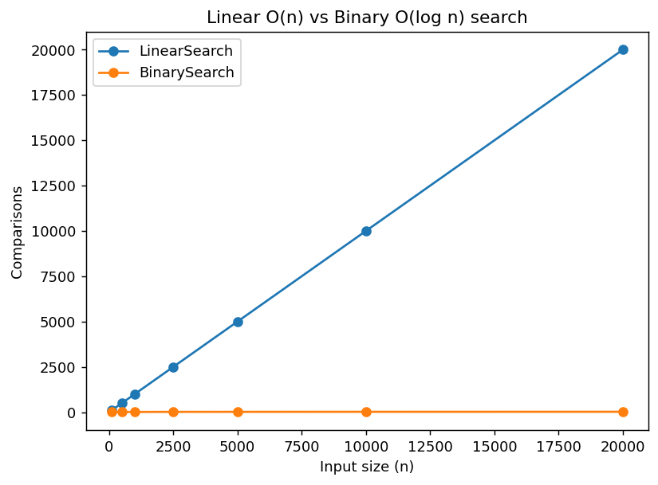
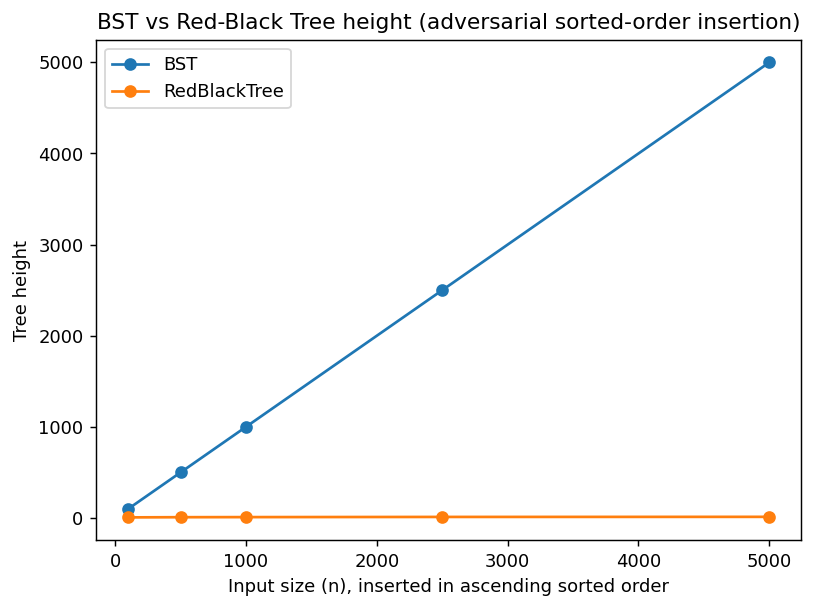
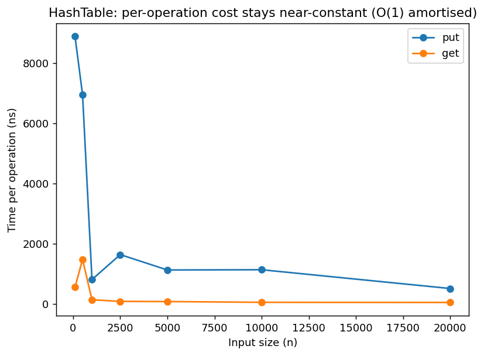
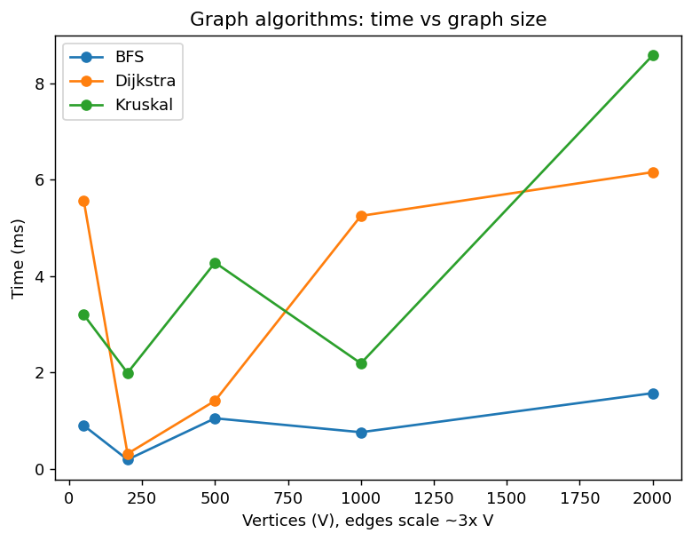

# GH-SHOC — Empirical Performance Analysis (Section 9 evidence)

All figures below come from real, timed runs (`ghshoc.perf.PerformanceHarness`,
plotted by `scripts/plot_performance.py`) — not theoretical estimates. Rerun
both to reproduce every number and chart yourself; that reproducibility is
itself useful evidence for the oral defense.

## 1. Sort algorithms — comparisons vs input size


Bubble, insertion, and selection sort (all O(n²)) form a clearly steeper
curve than merge sort and quick sort (O(n log n)) — visible as the two
groups separating as n grows, on a log-scaled y-axis. At n = 5000, the
O(n²) algorithms need ~12 million comparisons; merge sort needs ~55,000.

## 2. Insertion sort: best case vs average/worst case


On already-sorted input, insertion sort's inner while-loop never executes
— comparisons grow linearly (O(n)), exactly n−1 comparisons for n elements.
On random input, comparisons grow quadratically. This is the clearest
empirical demonstration in the whole dataset of how *input distribution*,
not just size, determines real-world performance — worth a paragraph in
the report distinguishing best/average/worst case formally (Section 7)
from what's measured here.

## 3. Linear vs binary search


Linear search comparisons grow linearly with n (worst case: target is the
last element, so comparisons = n). Binary search grows logarithmically —
at n = 20000, linear search needs 20000 comparisons in the worst case;
binary search needs at most ⌈log₂ 20000⌉ = 15.

## 4. BST vs Red-Black Tree height under adversarial insertion


This is the strongest result in the dataset. Inserting keys 1..n in
**ascending sorted order** — the textbook adversarial case for an
unbalanced BST — makes the plain BST degenerate into a linked list:
at n = 5000, height = 4999. The self-balancing Red-Black Tree, given the
identical insertion sequence, stays at height 12 (well within the
O(log n) ≈ 2·log₂(5001) ≈ 24.5 bound). This directly justifies including
a self-balancing tree in the design (Section 6) rather than relying on
the plain BST alone.

## 5. Hash table: near-constant per-operation cost


Dividing total time by n isolates the per-operation cost, which stays
roughly flat as n grows from 100 to 20000 — the expected signature of
O(1) amortised put/get, with the occasional resize cost smoothed out
across many operations.

## 6. Graph algorithms: time vs graph size


BFS (O(V+E)) and Dijkstra (O((V+E) log V)) scale close to linearly across
the tested range; Kruskal's MST (O(E log E), dominated by the from-scratch
merge sort over the edge list) tracks similarly since E ≈ 3V in this
generated dataset (sparse graph).

## How to regenerate
```
javac -cp lib/sqlite-jdbc-3.53.2.1.jar -d out $(find src/main -name "*.java")
java -cp out ghshoc.perf.PerformanceHarness data/performance
python3 scripts/plot_performance.py data/performance docs/charts
```
